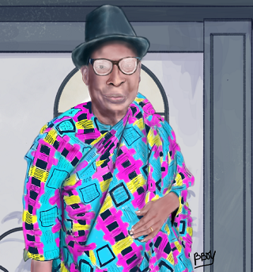

<!DOCTYPE html>
<html lang="fr">

<head>
    <meta charset="utf-8" >
    <title>Accueil - Blackboy illustration</title>
    <link href="style/style.css" rel="stylesheet" >
    <link href="style/index.css" rel="stylesheet" >
    <link rel="preconnect" href="https://fonts.googleapis.com"> <!-- Insertion de police -->
    <link rel="preconnect" href="https://fonts.gstatic.com" crossorigin>
    <link href="https://fonts.googleapis.com/css2?family=Manrope&family=Montserrat&display=swap" rel="stylesheet">
</head>

<body>
    <header>
        <nav style ="{
  display: flex;
  flex-direction: row;
  align-items: center;
  justify-content: space-between;
}">
            
            

                <a href="index.html" style="{margin-left: 30px;}">Accueil</a>
                <a href="a-propos.html" style="{margin-left: 30px;}">À propos</a>
                <a href="portfolio.html" style="{margin-left: 30px;}">Portfolio</a>
            

        </nav>
    </header>
    <main>
        <section style =" {  display: flex;  flex-direction: row;  width: 60%;  align-items: flex-start;  margin: auto;}" >
            

                <h1 style = "{  margin-bottom: 15px;}">Blackboy illustration</h1>
                

                    Où <em>professionalisme</em> s’allie avec <em>passion</em>. Depuis
                    plus de 5 ans maintenant, j’exerce mon métier avec la passion
                    qui m’anime : capturer l’essence de chaque instant.
                

                <a href="#contact" class="cta">UN PROJET ? ÉCRIVEZ-MOI</a>
            

            
        </section>
        <section style ="{  background-color: white;  padding: 80px;}">
            <h2 style="{  color: #242424;  text-align: center;  margin-bottom: 80px;}">Mon dernier projet </h2>
            

                
                
                
            

            

                
                
                
            

        </section>
        <section id="contact" style ="{  color: #a5b4fc;  text-align: center;  margin-bottom: 50px; padding: 50px 20px;}"class="section-contact">
            <h2>Parlons de votre projet</h2> <!-- Création de formulaire --> 
            <form method="get" action="#" style ="{  display: flex;  flex-direction: column;  width: 40%;  margin: auto;  color: white;}">
                

                    

                        <label for="nom">nom</label>
                        <input type="text" name="nom" id="nom" style ="{  padding: 15px;  border-radius: 3px;  border: none;}">
                    

                    

                        <label for="email" style ="{  margin-bottom: 10px;}">email</label>
                        <input type="email" name="email" id="email" >
                    

                

                <label for="message" style ="{  margin-bottom: 10px;}">message</label>
                <textarea name="message" id="message" rows="10" style ="{  padding: 15px;  border-radius: 3px;  border: none;}"></textarea>
                <input type="submit" value="ENVOYER" class="cta" style="input[type='submit'] {  width: 200px;  margin: auto;  margin-top: 30px;}">
            </form>
        </section>
    </main>
    <footer style ="{  display: flex;  flex-direction: row;  align-items: center;  justify-content: space-between;}">
        
        

            
            
        

    </footer>
  </body>
</html>
